  

I write software that has to keep working when nobody is watching. Edge devices aboard fishing
vessels in the Pacific, video that crosses a satellite link, and the interfaces people use on shore
to make sense of all of it. Most of my days move between a Python service, a React screen, and a
Linux box that is very far from any keyboard.

Based in Lima, Peru. More at **[yoiber.com](https://yoiber.com)**.

### Things you can actually open

Not screenshots. These are running right now, with seeded data, and you can log in and click around.
They scale to zero, so the first load takes a few seconds.

| Project | What it is | Open it |
|---|---|---|
| **SysRRHH** | HR system: hiring, contracts, attendance, leave and a job portal. Leave requests settle in `serializable` transactions and a partial index guarantees one active contract per employee. 571 tests. | [Demo](https://sysrrhh-demo-164532276262.us-central1.run.app) · `admin@demo.local` / `Demo1234!` |
| **KUIDY-CORE** | No-code platform: you define projects, modules and fields, and a generic engine renders the forms and validates the records. The validator is built at runtime from metadata and is the same on both sides of the wire. | [Demo](https://kuidy-core-demo-164532276262.us-central1.run.app) · `owner@kuidy.demo` / `Demo1234!` |
| **TechDocAPI** | REST API for the technical documentation of systems installed aboard vessels. Eight related entities, 47 documented routes, uniform paginated responses. | [Swagger](https://techdoc-api-164532276262.us-central1.run.app/api/swagger-ui.html) · no auth |
| **Reactive financial API** | Three reactive microservices: one decodes the client code, calls the other two in parallel and composes the answer. The correlation id travels through the Reactor context and you can check it live against the response header. 99 tests. | [Demo](https://financial-api-demo-164532276262.us-central1.run.app) · no auth |

These are demos: public, editable and full of made-up data. Treat them as such.

### Now

- **Deep Signal Stream.** Maritime video surveillance for a fleet operator: agents on industrial PCs
  aboard, video over SRT, control over MQTT, and one dashboard on shore. Two paths, on purpose: when
  the satellite link thins out, the video degrades and the telemetry still arrives.
- **Edge tooling.** Python agents that provision, update and watch industrial devices in the field,
  without a hand on the hardware.
- **Interfaces for live data.** React and TypeScript front ends fed by WebSockets, built to be read
  fast and trusted.

<table>
  <tr>
    <td></td>
    <td></td>
  </tr>
</table>

  

Almost all of that work lives in private client repositories, so the public commit count says very
little. The cards are generated every night by a GitHub Action straight from the GraphQL API, so the
private share is counted honestly instead of being hidden.

### What I reach for

| Backend | Front end | Edge and infrastructure |
| :--- | :--- | :--- |
| Python, FastAPI, SQLAlchemy, asyncio | React, TypeScript, Tailwind | MQTT, Modbus, industrial protocols |
| Java, Spring Boot, WebFlux, R2DBC | React Native | FFmpeg, SRT, video pipelines |
| Node.js, NestJS, Prisma, PostgreSQL | WebSockets, real-time interfaces | Linux, Docker, Nginx, Cloudflare |

### Work I am proud of and cannot link

Client systems, behind a login and under NDA. Happy to walk through any of them on a call.

- **Fleet monitoring at sea.** A distributed system that tracks vessels, their sensors and their
  cameras, designed for links that drop and come back. My code has crossed the Pacific more times
  than I have.
- **Field validation, web and mobile.** Technicians checking in on a fleet with QR codes and GPS, the
  same backend serving both platforms.
- **ERP for a clinical centre.** Appointments, billing and inventory for a business that cannot stop
  for a deploy.
- **Enterprise asset tracking.** The unglamorous, essential kind of system: every item, every owner,
  every change accounted for.

### How I think about it

Beautiful interfaces deserve boring, reliable backends. The best error message is the one that never
appears. And if a system only works while someone is looking at it, it does not work yet.

### Elsewhere

- Site: [yoiber.com](https://yoiber.com)
- LinkedIn: [linkedin.com/in/yoiberdev](https://linkedin.com/in/yoiberdev/)
- Happy to talk about IoT architecture, video over lossy links, React performance, or FastAPI in
  production.

  

