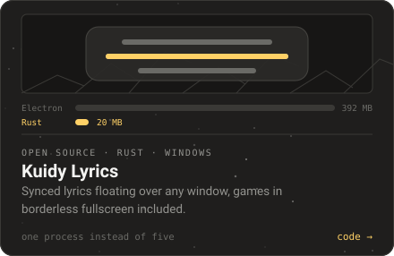

  

  Backend in Python, Node and Java, interfaces in React and TypeScript, and Linux machines a long way from any keyboard. 
  <a href="https://yoiber.com/en/">yoiber.com</a> · <a href="https://linkedin.com/in/yoiberdev/">LinkedIn</a> · <a href="https://yoiber.com/en/contact/">Get in touch</a>

### Three systems, explained from the inside

Each card opens the case on my site: the problem, the decisions it forced and how it turned out.

  <a href="https://yoiber.com/en/cases/field-operations-at-sea/"></a>

  <a href="https://yoiber.com/en/cases/kuantera/"></a>
  <a href="https://yoiber.com/en/cases/therapy-center-erp/"></a>

### Open source

  <a href="https://github.com/yoiberdev/docugraph-mcp"></a>
  <a href="https://github.com/yoiberdev/kuidy-lyrics"></a>
  <a href="https://github.com/yoiberdev/remezon"></a>
  <a href="https://github.com/yoiberdev/daebon"></a>
  <a href="https://github.com/yoiberdev/tsuzuku"></a>
  <a href="https://github.com/yoiberdev/km0"></a>

Live: Remezón at [sismos.yoiber.dev](https://sismos.yoiber.dev), Daebon at [doramas.yoiber.dev](https://doramas.yoiber.dev)
and Tsuzuku at [anime.yoiber.dev](https://anime.yoiber.dev). Daebon and Tsuzuku also have Android apps.

### You can open these

  <a href="https://comandas-dev.kipups.com"></a>
  <a href="https://contenido-dev.kipups.com"></a>
  <a href="https://nazca.yoiber.dev"></a>
  <a href="https://ajolote.yoiber.dev"></a>

Both Kip-Up demos use the same made-up ceviche restaurant, and their screens are in Spanish. Code for the
other two: [nazca](https://github.com/yoiberdev/nazca) · [ajolote](https://github.com/yoiberdev/ajolote).

  
  

  

Most of my work is in private client repositories. These cards count it, generated nightly from the API.

### Stack

`Python` `Django` `FastAPI` · `Node` `NestJS` `Next.js` `Prisma` · `Java` `Spring` · `PHP` `Laravel` ·
`Go` · `Rust` · `React` `TypeScript` `Svelte` `Vue` `Nuxt` · `Kotlin` `Capacitor` · `PostgreSQL` `MySQL` ·
`MQTT` `Modbus` `RTSP` `SRT` · `Docker` `Linux` `Nginx`

I reply in English or in Spanish: [yoiber.com/en/contact](https://yoiber.com/en/contact/).

  

