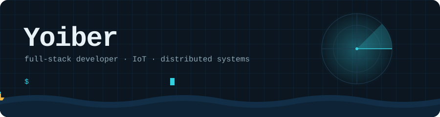
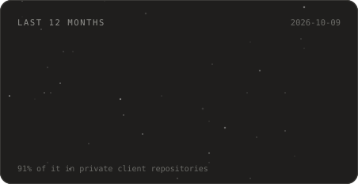
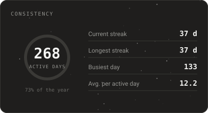
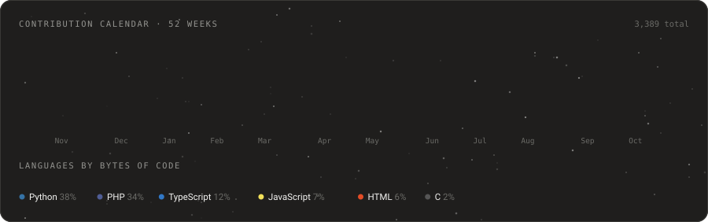
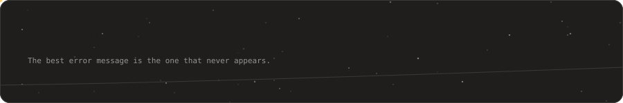

  

Full-stack developer in Lima, Peru. I build systems that keep working when nobody is watching. One
carries live video from cameras on vessels over a satellite link that drops several times a day;
another tells a company which of its technicians are on board right now. Backend in Python, Node and
Java, interfaces in React and TypeScript, and Linux machines a long way from any keyboard.

### Try them

Business systems with seeded data, public and editable. They scale to zero, so the first load takes a
few seconds.

| Project | What it does | Open |
|---|---|---|
| SysRRHH | HR: hiring, contracts, attendance and leave | [Demo](https://sysrrhh-demo-164532276262.us-central1.run.app) · `admin@demo.local` / `Demo1234!` |
| KUIDY-CORE | You declare modules and fields, and the forms are ready to use | [Demo](https://kuidy-core-demo-164532276262.us-central1.run.app) · `owner@kuidy.demo` / `Demo1234!` |
| TechDocAPI | REST API with 8 entities and 47 documented routes | [Swagger](https://techdoc-api-164532276262.us-central1.run.app/api/swagger-ui.html) |
| Reactive financial API | Three reactive services, one composed answer | [Demo](https://financial-api-demo-164532276262.us-central1.run.app) |

### Side projects

Live, with the code public.

| Project | What it is |
|---|---|
| [Tsuzuku](https://anime.yoiber.dev) · [code](https://github.com/yoiberdev/tsuzuku) | Anime tracker for the web and Android, on the AniList API. Your list episode by episode, the week's airing schedule in your time zone, where to watch each show legally and alerts when a new episode airs. A small Node service translates the synopses to Spanish. |
| [km 0](https://github.com/yoiberdev/km0) | Android activity recorder in the spirit of Strava. If you hit start halfway through a walk, it rebuilds the missing stretch from Health Connect and snaps it to the streets. Svelte and MapLibre inside Capacitor, with Kotlin plugins for GPS and Health Connect. |
| [Nazca](https://nazca.yoiber.dev) · [code](https://github.com/yoiberdev/nazca) | A dawn flight over the Nazca lines. The figures are buried under the sand and the light of your cursor uncovers them. three.js through Threlte, every shape drawn in code. |
| [Ajolote](https://ajolote.yoiber.dev) · [code](https://github.com/yoiberdev/ajolote) | My pet on the web: a block axolotl that lives in its cave. Click it and it flips and changes color. |

### Case studies

Five systems explained from the inside on [my site](https://yoiber.com/en/): what the problem was,
which decisions it forced and what the result looks like.

- [Live video from vessels that keep losing the link](https://yoiber.com/en/cases/live-video-from-vessels/)
- [Who is on board right now](https://yoiber.com/en/cases/field-operations-at-sea/)
- [The receipt leaves the system and the tax office accepts it](https://yoiber.com/en/cases/kuantera/)
- [You define a field and the form is already there](https://yoiber.com/en/cases/kuidy-core/)
- [Twenty modules around the day's schedule](https://yoiber.com/en/cases/therapy-center-erp/)

<table>
  <tr>
    <td></td>
    <td></td>
  </tr>
</table>

  

Most of my work is in private client repositories. These cards count it, generated nightly from the API.

### Stack

`Python` `FastAPI` · `Java` `Spring` `WebFlux` · `Node` `NestJS` `Prisma` · `PHP` `Laravel` ·
`React` `TypeScript` `Svelte` · `Kotlin` `Capacitor` · `Rust` · `PostgreSQL` · `MQTT` `Modbus` `SRT` ·
`Docker` `Linux` `Nginx`

### Get in touch

[yoiber.com](https://yoiber.com) · [LinkedIn](https://linkedin.com/in/yoiberdev/) ·
[contact form](https://yoiber.com/en/contact/). I reply in English or in Spanish.

  

